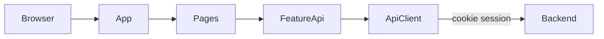
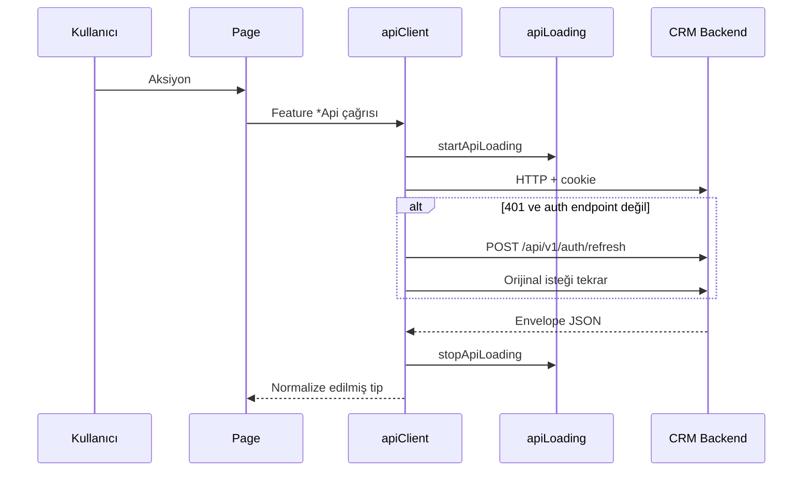

# Mimari

## Katmanlı yapı

İş alanları `src/features/<modül>/` altında feature-sliced durur:

```
src/features/<modül>/
  components/     # Sayfalar ve modallar
  services/       # *Api.ts — HTTP + snake_case → camelCase tipler
  hooks/          # (auth, dashboard)
  schemas/        # Zod (auth, dashboard)
  constants/      # Türkçe UI metinleri (*Texts.ts)
  utils/          # (customers, dashboard)
```

### Katman sorumlulukları

| Katman | Sorumluluk |
|--------|------------|
| `app/` | Session, path, sayfa dispatch (`App.tsx`) |
| `features/*/components` | Ekran, form, modal, permission ile aksiyon gizleme |
| `features/*/services` | Backend envelope okuma, tip normalizasyonu |
| `services/` | Axios instance, 401 refresh, global loading |
| `shared/` | Layout, overlay, global CSS, deep-link helper |

Bağımlılık yönü: `components` → `services` (feature) → `apiClient`. Feature’lar birbirini sınırlı çağırır (ör. tasks sayfası `getCustomer`).

## Modüller (feature’lar)

| Feature | Path | Route |
|---------|------|-------|
| `auth` | `src/features/auth` | `/` |
| `hello` | `src/features/hello` | `/home` |
| `dashboard` | `src/features/dashboard` | `/dashboard` |
| `customers` | `src/features/customers` | `/customers`, `/customers/full-registration/:id` |
| `tasks` | `src/features/tasks` | `/tasks` |
| `followUps` | `src/features/followUps` | `/follow-ups` |
| `ietts` | `src/features/ietts` | `/ietts` |
| `authorization` | `src/features/authorization` | `/permissions` |

Paylaşılan altyapı:

- `src/services/apiClient.ts` — Axios + interceptors
- `src/services/apiLoading.ts` — pending request sayacı
- `src/shared/components/AppLayout.tsx` — sidebar / header
- `src/shared/components/GlobalLoadingOverlay.tsx`
- `src/shared/styles/global.css`
- `src/shared/utils/navigation.ts` — full-registration deep link

Consume feature yoktur.

## Uygulanan prensipler

Clean Architecture ve SOLID — detay: repo kökü `.cursor/rules/clean-architecture.mdc`

- **Feature-sliced** klasör ayrımı
- **Manuel routing** — `history.pushState` / `popstate`; router kütüphanesi yok
- **Cookie session** — `withCredentials: true`; Bearer header yok
- **UI RBAC** — `*.menu` route, diğer `permissions[].name` aksiyon
- **Anti-Corruption (hafif)** — snake_case JSON, feature `*Api.ts` içinde camelCase tipe çevrilir
- **Prop drilling** — session / permissions context store olmadan `App` → sayfa
- **Global loading** — her Axios isteği overlay sayacını artırır

## Composition root

`src/main.tsx` + `src/app/App.tsx`:

1. `QueryClientProvider` (dashboard için)
2. Path state (`window.location.pathname`)
3. `getSession()`; başarısızsa `refreshSession()`
4. Authenticated `/` → `/home`; unauthenticated diğer path → `/`
5. `pageFromPath` + `*.menu` ile sayfa seçimi
6. `AppLayout` içinde ilgili page component

## Yüksek seviye akış



## İstek yaşam döngüsü



## Dizin yapısı

```
index.html
vite.config.ts
vitest.config.ts
.env.example
src/
  main.tsx
  app/App.tsx
  services/
    apiClient.ts
    apiLoading.ts
  shared/
    components/
    styles/global.css
    utils/navigation.ts
  features/
    auth/
    authorization/
    customers/
    dashboard/
    followUps/
    hello/
    ietts/
    tasks/
docs/
```

## Response sözleşmesi

Backend JSON envelope (`success`, `message`, `data`, `errors`) feature servislerinde okunur. Paylaşılan envelope tipi yoktur; her `*Api.ts` kendi `ApiEnvelope<T>` tanımını tekrarlar.

- Başarı: `data` normalize edilir
- 422: customer/task/follow-up create’te `errors` alan bazlı `*ValidationError` olarak fırlatılır

Detay: [06-data-model.md](./06-data-model.md), [08-api-reference.md](./08-api-reference.md).
