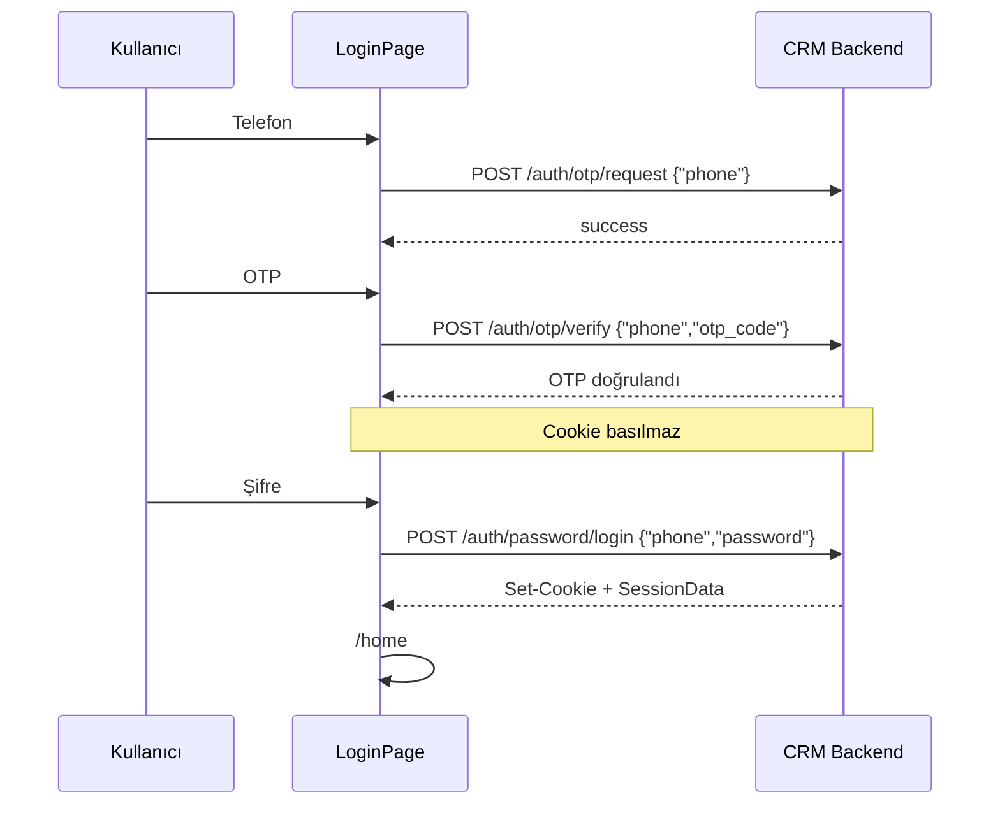

# Auth ve RBAC

## Kimlik doğrulama özeti

Kimlik CRM backend üzerinden Umramonline’da doğrulanır. Frontend token üretmez ve saklamaz; tarayıcı HttpOnly cookie taşır (`withCredentials: true`).

**Path:** `src/features/auth`

OTP verify oturum açmaz. Session yalnızca password login cevap cookie’leriyle oluşur.

## Auth endpoint’leri (FE çağrıları)

| Method | Path | Servis fonksiyonu | Açıklama |
|--------|------|-------------------|----------|
| POST | `/api/v1/auth/otp/request` | `requestOtp` | OTP gönder |
| POST | `/api/v1/auth/otp/verify` | `verifyOtp` | OTP doğrula — cookie basmaz |
| POST | `/api/v1/auth/password/login` | `loginWithPassword` | Login + cookie + `SessionData` |
| POST | `/api/v1/auth/refresh` | `refreshSession` / interceptor | Access yenile |
| POST | `/api/v1/auth/logout` | `logout` | Cookie temizle |
| GET | `/api/v1/auth/session` | `getSession` | Session + permissions |

Kaynak: `src/features/auth/services/authApi.ts`.

## Login akışı

UI adımları `useLoginFlow`: `phone` → `otp` → `password`.



### Kritik davranış

- **OTP verify session açmaz.**
- `rememberMe` UI’da vardır; `submitPassword` parametresi `_rememberMe` olarak yok sayılır (cookie TTL backend config).
- Başarılı login sonrası `App` `session` state’ini set eder ve `/home`’a gider.

### Validasyon (Zod)

**Path:** `src/features/auth/schemas/authSchemas.ts`

| Alan | Kural |
|------|-------|
| Telefon | `^05\d{9}$` |
| OTP | tam 6 rakam |
| Password | trim, min 1 |

Metinler: `src/features/auth/constants/authTexts.ts`.

## Session bootstrap

`App.tsx` her path değişiminde:

1. `getSession()`
2. Hata → `refreshSession()`
3. Hata → `session = null`, `/` dışındaysa login’e yönlendir
4. Session var ve path `/` ise `/home`

401 interceptor (`apiClient.ts`):

- `/api/v1/auth/*` URL’lerinde refresh **yapılmaz** (döngü önleme)
- Diğer 401’lerde tek sefer `POST /auth/refresh` (promise dedupe), sonra orijinal istek retry
- Refresh ayrı `refreshClient` instance ile atılır (interceptor zincirine girmez)

## Session modeli

Frontend `SessionData`:

| Alan | Kaynak JSON |
|------|-------------|
| `userId` | `user_id` |
| `user.id` | `user.id` |
| `user.full_name` | `user.full_name` (camelCase’e çevrilmez) |
| `user.phone` | `user.phone` |
| `user.roleId` | `user.role_id` |
| `user.roleName` | `user.role_name` |
| `permissions[]` | `module_id` → `moduleId`, `name`, `method`, `path`, … |

> **Not:** `user.full_name` ve `user.phone` snake_case bırakılır. `branch_ids` / `branches` FE tipinde yoktur; UI şube kapsamını session’dan okumaz, backend listeleri zaten scope’lar.

## RBAC — iki katman

### 1. Route / menü (`*.menu`)

`App.tsx` + `AppLayout`:

| Permission | Path | Sayfa |
|------------|------|-------|
| (oturum) | `/home` | `HelloPage` |
| `dashboard.menu` | `/dashboard` | `DashboardPage` |
| `customers.menu` | `/customers` | `CustomersPage` |
| `customers.menu` | `/customers/full-registration/:id` | `CustomerFullRegistrationPage` |
| `tasks.menu` | `/tasks` | `TasksPage` |
| `follow_ups.menu` | `/follow-ups` | `FollowUpsPage` |
| `ietts.menu` | `/ietts` | `IettsPage` |
| `authorization.menu` | `/permissions` | `AuthorizationPage` |

Yetkisiz path `pageFromPath` ile `"home"` fallback’ine düşer (URL değişmez ama Anasayfa render edilir).

### 2. Sayfa içi aksiyonlar

Her sayfa `new Set(permissions.map(p => p.name))` ile buton/API çağrısını gizler. UI gizleme API’yi korumaz; 403 backend’den gelir.

## Rol bazlı istisna (task listesi)

`TasksPage` permission yanında hardcoded rol seti kullanır:

```ts
const unrestrictedTaskRoleIds = new Set([30, 60, 63]);
```

Bu roller `tasks.list` ile tüm görevleri görür. Diğer roller `tasks.assigned.list` (yoksa `tasks.list`) ile `GET /tasks/assigned-to-me` tercih eder.

Admin BE’de `role_id = 30`. FE 60 ve 63’ü de “unrestricted” sayar.

## UI-only vs API permission

`*.menu` ve `*.form` HTTP path taşımayabilir; yalnızca görünürlük içindir. API çağrıları ilgili `*.list` / `*.create` / `*.update` olmadan 403 alır.

Authorization admin permission’ları: [05-modules/authorization.md](./05-modules/authorization.md).
Diğer modül permission listeleri ilgili modül dosyalarında.
