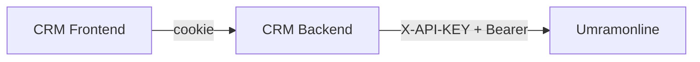

# Umramonline Entegrasyonu

## Genel

Frontend Umramonline HTTP client’ı **içermez**. Tüm UO erişimi CRM backend proxy’si üzerinden olur (cookie session). API key / Bearer UO token tarayıcıya hiç gitmez.

Backend detayı: `crm-be/docs/07-umramonline-integration.md`.

## FE’nin gördüğü yüzeyler

### Auth

OTP request/verify ve password login CRM `/api/v1/auth/*` path’leri. UO path’leri FE’de hardcoded değildir.

### Müşteri çift kaynak

| UI davranışı | Backend path |
|--------------|--------------|
| Galeri listesi | `GET /api/v1/customers` (merge/scope BE + permission) |
| Backend detay | `GET /api/v1/customers/backend/:id` |
| UO detay | `GET /api/v1/customers/umramonline/:id` (`uoId`) |
| Arama | `GET /api/v1/customers/search` — `source: backend \| umramonline` |
| Cep uniqueness | `GET .../full-registration/:id/phone-exists` (her iki kaynak BE’de) |

`CustomersPage` satır detayı backend id kullanır. `TasksPage` müşteri `uoId` varsa umramonline detay da yükler (plus card / credit). `StandaloneFollowUpModal` aynı: backend detay + `uoId > 0` ise UO detay (`plusCardDetail`).

Permission isimleri kaynak ayırır: `customers.list.umramonline`, `customers.detail.backend`, `*.my_branches`. Liste çağrısı yine tek `GET /customers`; hangi kaynağın dolacağı role bağlıdır.

### Referans verisi

Zones, cities, towns, branches, branch users — FE bunları CRM’den ister. Dropdown’lar UO origin’ine gitmez.

| Fonksiyon | Path |
|-----------|------|
| `listZones` | `/api/v1/zones` |
| `listCities` | `/api/v1/cities` |
| `listTowns` | `/api/v1/towns?city_id=` |
| `listBranches` | `/api/v1/branches` |
| `listTaskAssignableUsers` | `/api/v1/branches/:id/users` |
| `listRoles` | `/api/v1/authorization/roles` |

### Dashboard

`vehicle_entry_count`, `total_amount`, `loaded_credit_amount` UO kaynaklıdır ama FE tek `DashboardStats` görür. `branch_ids` query FE göndermez.

### Kullanılmayan UO yüzeyleri

| Konu | FE |
|------|-----|
| Task SMS | Yok — create task sonrası SMS BE tarafı |
| Consume webhook | Yok |
| Sync CLI | Yok |
| UO MySQL | Yok |

## Anti-Corruption (FE)

`*Api.ts` UO/BE JSON farkını (snake_case, bazen `ID`/`Name`) camelCase tipe çevirir. `data_source` query string’i listede kullanılmaz; detay path’i `customerDetailBasePath` seçer.

## Hata yaklaşımı

UO timeout / 5xx FE’de özel map edilmez; Axios error → sayfa `message` / React Query `isError`. 401 → refresh (auth hariç).
